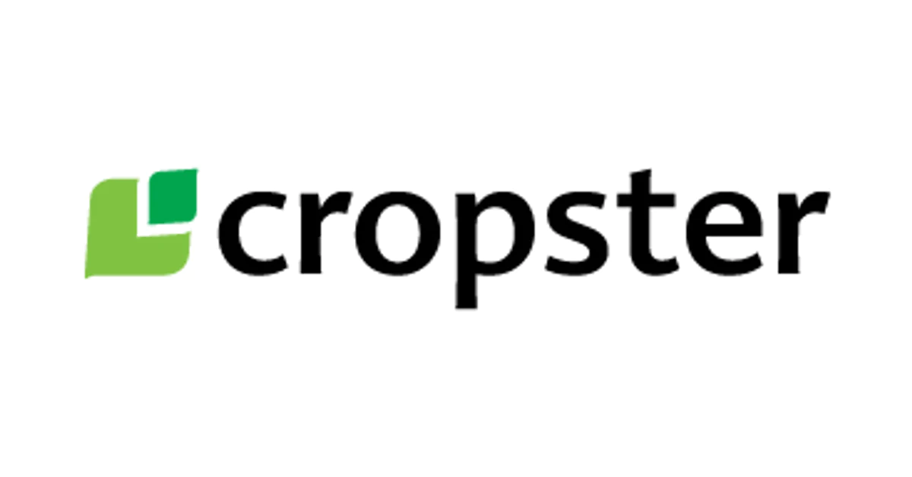

# Cropster.com

## Overview

Cropster.com is a comprehensive web platform designed to support farmers by providing valuable knowledge, resources, and a dedicated chatting platform. The website offers a range of features aimed at educating farmers on various aspects of agriculture and fostering a community where they can share experiences and seek advice.

## Features

- **Knowledge Base**: Access articles, guides, and tutorials on farming techniques, crop management, pest control, and more.
- **Chatting Platform**: Connect with other farmers through a secure chat system to discuss issues, share tips, and collaborate.
- **Resource Center**: Find information on farming tools, weather forecasts, and market prices.
- **User Authentication**: Secure login and registration to ensure privacy and security.

## Tech Stack

- **Frontend**: HTML, CSS, JavaScript
- **Styling**: CSS
- **Chatting Platform**: JavaScript

## Installation

### Prerequisites

Make sure you have the following installed:

- [A modern web browser](https://www.google.com/chrome/)
- [Text editor](https://code.visualstudio.com/) (e.g., Visual Studio Code)

## Usage

- **Knowledge Base**: Browse through a variety of articles, guides, and tutorials on farming techniques, crop management, pest control, and other agricultural topics.
- **Chatting Platform**: Engage with other farmers through the secure chat system. Share experiences, ask questions, and collaborate on farming solutions.
- **Resource Center**: Utilize the available resources such as farming tools, weather forecasts, and market prices to enhance your farming practices.

## Authors

- [CNavneeth](https://github.com/CNavneeth)
- [Shrikara P S Nakshatri](https://github.com/Nakshatri24)

